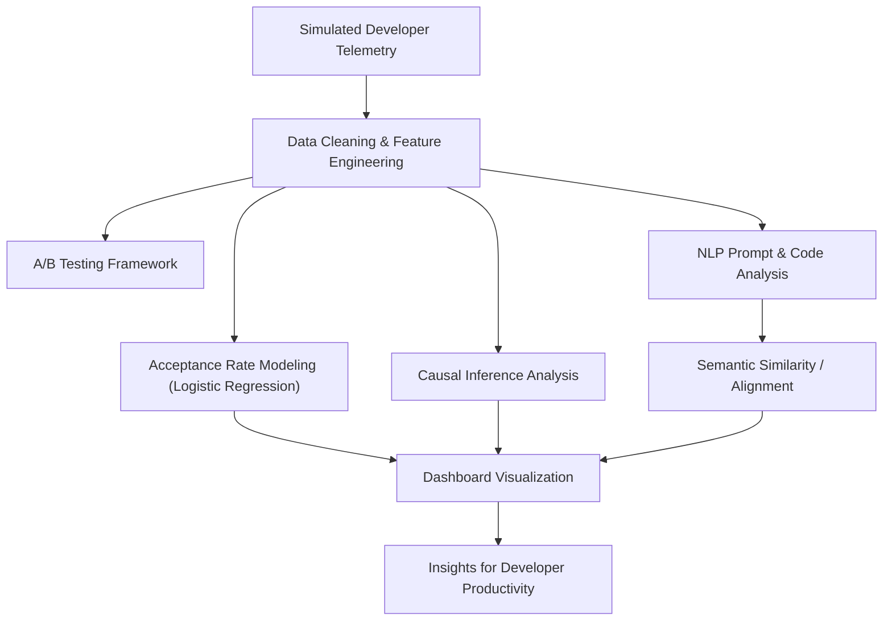

# LLM Developer Tools Evaluation Framework  
A complete, end-to-end pipeline for analyzing developer telemetry, evaluating LLM code generation quality, running causal inference, and measuring developer productivity metrics.

This repository demonstrates real-world applied AI evaluation workflows used in measuring code generation model performance and developer impact.

---

## 🎯 Who Is This Repo For?

This repo is designed for **three audiences**, each with a guided path:

### 👶 Beginners / Recruiters → Start here  
**👉 `/docs/01_QUICK_START.md`**  
Run the project in 5 minutes — no ML background required.

### 🛠️ Learners / Students → Understand the system  
**👉 `/docs/02_GETTING_STARTED.md`**  
Step-by-step walkthrough of telemetry, evaluation, models, and dashboards.

### 🧠 Senior Reviewers / Hiring Managers → Deep technical reasoning  
**👉 `/docs/04_SHOWCASE_SUMMARY.md`**  
**👉 `/docs/05_METHODOLOGY.md`**

---

## 📦 What This Repo Demonstrates (End-to-End Pipeline)

